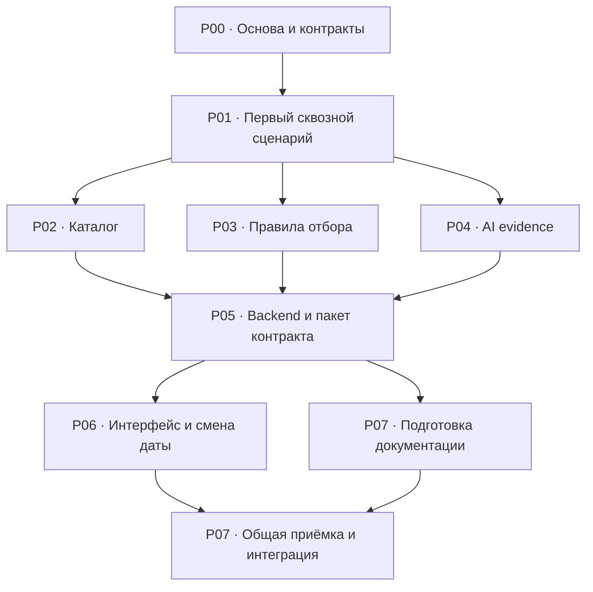

# План реализации по модулям

Подготовлен 2026-09-23 по [архитектуре](../architecture/README.md), [согласованному решению](../.brainstorming/2026-09-23-contractor-selection-architecture-design.md) и [правилам проекта](../AGENTS.md). Здесь задания для будущих worktree, а не свидетельство готовности приложения.

## Как пользоваться

1. Начать с **P00**, затем выполнить **P01** последовательно одним владельцем.
2. После первого работающего сквозного сценария выполнять **P02, P03, P04** в независимых worktree от одного зафиксированного коммита.
3. **P05** собирает backend и публикует проверенный контракт для фронтенда.
4. **P06** завершает интерфейс по этому контракту. Во время P06 координатор может готовить документацию P07; финальная приёмка P07 начинается после P06.
5. **P07** проверяет общий кандидат и выполняет разрешённую интеграцию. **P90** — необязательный эксперимент после обязательной работы.

Каждая карточка описывает цель, владельца файлов, входные зависимости, допустимые импорты, проверки и результат передачи. Передать исполнителю её абсолютный путь и заполненную секцию задания из OpenSpec. Исполнитель читает эту карточку, общие правила ниже и только необходимые ссылки.

**Один продуктовый change:** предлагаемое имя `contractor-selection-mvp`. Создать его через OpenSpec в P00; сейчас такого change нет. P00–P07 становятся группами задач одного change с теми же ID, а не восемью одновременно активными change. `.proposals` остаётся исходной декомпозицией. Точные требования, контракты, решения, назначения и текущие стадии после переноса принадлежат `openspec/changes/contractor-selection-mvp/`; карточки ссылаются на них и не ведут параллельную доску статусов. Артефакты OpenSpec писать на английском.

## Что означает «принят»

Во всех карточках **«принятый этап / SHA / кандидат» означает готовность для зависимого этапа**, а не окончательную доставку. Для такой передачи координатор подтверждает:

- Необходимые именно для следующего этапа проверки пройдены; результаты, режим и ограничения записаны и относятся к передаваемому содержимому.
- Точный commit SHA закреплён и доступен следующей worktree; нужные contracts/examples и, для P06, immutable package доступны и сверены со своими коммитами.
- Предыдущий владелец прекратил запись в передаваемые файлы; зафиксированы следующий владелец, allowed paths и действующие holds.
- Нет нерешённого блокера, который делает зависимую работу недостоверной. Требования публикации feature-ветки и запреты Git-записей сохраняют силу; наличие локального SHA не означает успешный push.

Это не новая стадия вместо принятой stage table: фиксируются фактические `implemented`, `committed` или `branch-pushed`, а готовность передачи отмечается в evidence/next action. **`integrated` и `[x]` наступают только после общей приёмки и подтверждённого remote `main` в P07.** Ожидание этой финальной публикации не мешает передаче уже проверенных закреплённых модулей, поэтому циклической зависимости P02–P06 от завершения P07 нет.

## Очередность и параллельность

| ID / файл | Результат | Когда начинать | С чем можно параллельно |
| --- | --- | --- | --- |
| [P00](00-foundation-and-contracts.md) | Готовая база, OpenSpec, замороженные публичные и межмодульные контракты | Первым; снять реальные блокеры базы | Ничего из зависимой реализации |
| [P01](01-first-working-slice.md) | Реальный CSV → правила → OpenAI → HTTP → экран | После P00 | Последовательно, один владелец |
| [P02](02-catalog-module.md) | Надёжный каталог и справочники | После принятого P01 | P03, P04 |
| [P03](03-selection-domain.md) | Полные правила отбора, порядок и причины | После принятого P01 | P02, P04 |
| [P04](04-evidence-module.md) | Проверенные цитаты и корректные отказы AI | После принятого P01 | P02, P03 |
| [P05](05-backend-composition-and-handoff.md) | Собранный backend, HTTP, immutable-пакет для UI | После принятых P02–P04 | Подготовка без записи в занятые модули; не финальная интеграция заранее |
| [P06](06-frontend-flow.md) | Все состояния и объяснение смены даты | После P05 и закрепления пакета | Подготовка документации P07 |
| [P07](07-integration-and-delivery.md) | Проверенный общий кандидат и воспроизводимый запуск | Документы после P05; финальные проверки после P06 | Документы с P06; финальная сборка последовательно |

P02–P04 логически независимы. В текущем `.codex/config.toml` лимит **3 одновременные задачи**, включая координатора: безопасная раскладка — координатор + два исполнителя. Например, запустить P03 и P04, затем P02 в освободившемся слоте; либо координатор сам делает P02, пока два исполнителя делают P03/P04. Не повышать лимит ради плана. Для независимых сессий также соблюдать одного владельца каждого файла.

Архитектура требует сначала проверить внешний риск и один настоящий сквозной сценарий. Поэтому начинать все модули одновременно от текущего `main` нельзя. P02–P04 **дополняют** минимальные реализации P01; уже реализованное и достаточно проверенное повторно не переписывают. Если модуль уже удовлетворяет своей карточке, передают существующее свидетельство без пустого коммита.

## Владение файлами и направление зависимостей

Пути ниже предлагаются для фиксации в P00. Изменение пути или интерфейса согласовать через координатора до запуска зависимых задач.

| Поверхность | Единственный владелец после P01 | Разрешённые зависимости |
| --- | --- | --- |
| `contracts/` | Координатор | Только обычные типы/данные, без React, Next.js, AI, файловой системы и Zod |
| `back/domain/types.ts`, `back/recommend/ports.ts` | Координатор, заморожены перед параллельной работой | Публичные типы и независимые доменные данные; никаких реализаций адаптеров |
| `back/catalog/` | P02 | Публичные доменные типы, файловая система, CSV-парсер, валидация |
| `back/domain/`, кроме `types.ts` | P03 | Публичные доменные/JSON-типы; чистые функции |
| `back/ai/evidence/` | P04 | Публичный порт evidence, доменные типы, уже существующий транспорт OpenAI |
| `back/ai/openai.mjs`, `back/config/` | Существующие владельцы; изменения только через координатора | Существующие контракты transport/secrets |
| `back/recommend/`, кроме замороженного `ports.ts` | Координатор в P05 | Домен и внедрённые функции каталога/evidence; не конкретные адаптеры |
| `back/http/`, `back/composition.ts`, `src/app/` | Координатор | HTTP → use case; composition → конкретные адаптеры; страницы → `front/` |
| `front/` | P06 | React, публичные JSON-контракты, same-origin HTTP; никаких импортов `back/` |
| `package.json`, lockfile, общая конфигурация, OpenSpec, `.shared/specs/` | Координатор | Один автор; запросы изменений от исполнителей |
| README, `.env.example`, `THIRD_PARTY.md`, документация запуска | Координатор в P07 | Навык project-delivery, фактически проверенный запуск |

`back/domain/types.ts` и `back/recommend/ports.ts` — явно опубликованные внутренние границы, а не разрешение импортировать произвольные файлы соседнего модуля. Публичные HTTP-типы не содержат исходные описания и календари. Реализации каталога и AI соединяет только composition. Циклов зависимостей быть не должно.

Минимальная форма и карточки относятся к P01. Перед P06 P01 прекращает запись в `front/`; P06 не меняет `src/app/`. Проверки модуля находятся рядом с ним; общие HTTP/E2E-проверки принадлежат координатору.

## Снимок после ревью, до публикации подготовки 2026-09-23

- Основной checkout: `D:/Alem/hack-83108e9d-the-power-of-dreams`, ветка `main`, локальный HEAD `f2aea352a3c7f92804cab1a353aa787498ff0e56` (`chore: add project harness configuration`). Удалённый HEAD в этой задаче не проверялся.
- Remote: `origin` → `https://github.com/BAITC-Hacks/hack-83108e9d-the-power-of-dreams.git`.
- Harness уже отслеживается Git: `AGENTS.md`, `.codex/config.toml`, `.agents/skills/`, `openspec/config.yaml`, `.gitignore`, tooling-документация. Архитектура, продуктовые/domain-документы, текущие change-артефакты, package-файлы, данные и backend-подготовка по-прежнему среди незакоммиченных файлов; README изменён. Новый worktree от этого HEAD получит harness, но не всю необходимую продуктовую базу.
- `back/config/secrets.mjs` и `back/ai/openai.mjs` существуют локально. [Карточка OpenAI](../openspec/changes/openai-response-adapter/tasks.md) фиксирует `implemented` для 1.1, 1.2, 2.1: две успешные plain-text live-пробы (4114/2496 мс), 6/6 контрактных проверок, включая disposable copy. Хеш текущего адаптера `C9F07FD119911CE2D3BE542AD4C40C9911142689DFF45780A3A2BBC173ABF47F` совпал с evidence; хеши обоих verification scripts также совпали. Это существующие свидетельства, в этом обновлении проверки/live-вызовы не перезапускались. Пункт 2.2 остаётся `planned`.
- Транспорт повторно реализовывать не нужно. Его plain-text live-пробы и controlled schema-forwarding не доказывают domain evidence extraction, качество объяснений или приложение: P01 по-прежнему нужен probe на настоящих описаниях и браузерный сценарий. У local-secrets сохраняются записанные локальные проверки; сверить актуальные owners/holds перед переносом, не повторять реализацию по пустому checkbox.
- `openspec list --json`: `unified-local-secrets` — 0/4; `openai-response-adapter` — 0/4; `brev-gpu-access` — 4/4. Эти числа не являются готовностью MVP. Brev/GPU не нужен для выбранного MVP.
- В существующих карточках secrets/OpenAI записан **no-commit/no-push/no-merge**. План его не отменяет. Не публиковать эти изменения автоматически как часть новой базы.
- Зарегистрирован worktree `D:/Alem/hack-83108e9d-the-power-of-dreams-wt-unified-local-secrets`; не занимать его другой задачей. Файлов приложения в `front/` и `src/` и готового frontend-пакета при повторном осмотре не обнаружено. Эти сведения — снимок; P00 перепроверяет их перед действием.

### Последующее разрешение на публикацию

После ревью пользователь явно поручил закоммитить и отправить все текущие файлы проекта, чтобы начать работу в worktree. Это разрешение **снимает прежний no-commit/no-push/no-merge hold для публикации существующей подготовки**. Старые записи выше и в исторических task cards описывают прошлое состояние и не блокируют этот commit/push. Секреты, установленные зависимости, кеши и служебный marker в публикацию не входят.

Публикация не означает выполнение P00, domain probe или приёмки MVP. Следующий исполнитель начинает с P00 от подтверждённого опубликованного `main`, фиксирует актуальный base SHA и создаёт contracts/OpenSpec. Обычные правила Git и feature delivery из AGENTS.md действуют; исторический запрет на эту подготовку повторно не запрашивать. Фактическое свидетельство публикации хранится в [существующей task card](../openspec/changes/openai-response-adapter/tasks.md#preparation-baseline-publication).

**Подготовка опубликована:** исходный коммит `7d611a971e48b89c26776e6f10dbb4f5bfba7ee2` подтверждён в `origin/main`. Чистый checkout этого коммита содержит harness, данные, планы и модули; 4/4 проверки secrets и 6/6 OpenAI transport прошли без `.env` и установленных зависимостей. Новых live-проверок и проверки приложения не было. Для старта P00 брать актуальный `main`, включающий этот коммит и последующие записи результатов; наличие committed base больше не является прежним блокером, а contracts и продуктовый OpenSpec всё ещё нужны.

## Обязательные условия запуска каждой worktree

Координатор заполняет в существующем `tasks.md` продукта поля `Task`, `Scope`, `Context`, `Authorization`, `Checks`, `Dependencies`, `Return` по [AGENTS.md](../AGENTS.md). Фактические owner task ID, base SHA, harness revision, проверенные/опубликованные SHA сейчас неизвестны и **не подменяются** предполагаемыми значениями.

- Рабочие деревья создавать только как соседей: `D:/Alem/hack-83108e9d-the-power-of-dreams-wt-cs-<id>`; точные имена в карточках. До создания проверить каталог и список Git worktree, занятый путь не перезаписывать.
- База должна содержать необходимые harness-файлы, данные, зависимости, контракты и примеры **в коммите**. Проверить `AGENTS.md`, `.codex/config.toml`, выбранную роль, нужные `.agents/skills/`, `openspec/config.yaml` в самой worktree. Наследование сессии не заменяет проверку.
- Все P02–P04 стартуют от одного принятого SHA P01. Реализацию не основывать на незакоммиченном содержимом соседнего checkout. При изменении breaking-контракта остановить затронутых потребителей, обновить артефакты и базу, затем возобновить.
- Отдельные зависимости/сборочные выходы, временные каталоги и тестовые данные в каждой worktree. Каталог CSV только читается; для отрицательных проверок — временные копии. Настоящий `.env` не править и не копировать в пакет/коммит. Настройку секретов выполнять существующим server-only механизмом.
- Исполнители не редактируют общие файлы и чужую staged-область; изменения зависимостей/маршрутов/типов передают координатору. Не использовать `git add .`/`git add -A`.
- Перед записью в integration-worktree, публикацией shared-пакета или продвижением `main` координатор эксклюзивно создаёт `D:/Alem/hack-83108e9d-the-power-of-dreams/.shared/integration-owner.json` по AGENTS.md. Занятость не истекает по таймеру; указать владельца и ресурсы в OpenSpec. Только свой marker можно освободить после остановки записей/процессов.
- Исполнители возвращают `Status`, `Result`, `Evidence`, `Revision`, `Next`; реальные проверки отделяют от fixtures и пропусков. Только координатор меняет общую stage table и checkboxes.

## Как собрать всё в одной ветке

Координатор использует `D:/Alem/hack-83108e9d-the-power-of-dreams-wt-integration`, предлагаемую ветку `codex/contractor-selection-integration`, под общей reservation. Это единственный общий кандидат, не место одновременной работы модулей.

1. Зафиксировать принятую P00/P01 базу и текущий согласованный `main`; учитывать только разрешённые изменения.
2. Последовательно включить точные принятые SHA P02 → P03 → P04. Их порядок merge технически независим; выбранный порядок упрощает диагностику. После этого выполнить P05 в кандидате и зафиксировать backend SHA.
3. Выпустить immutable-пакет P05 отдельным коммитом. P06 стартует от кандидата, содержащего backend и этот пакет. Между этим закреплением и приёмкой UI backend/пакет не менять молча.
4. Включить точный SHA P06, завершить P07. На время финальной приёмки заморозить запись в кандидате; проверить реальные связи модулей, production build/start, browser-сценарии и live AI отдельно.
5. Перед продвижением `main` выполнить [переход материализованного пакета под контроль Git](05-backend-composition-and-handoff.md#переход-пакета-под-контроль-git): остановить потребителей, проверить snapshot/ownership, сохранить и временно убрать только собственные неизменённые untracked-файлы. Даже одинаковое содержимое не гарантирует отсутствие Git-конфликта. Если публикация разрешена и проверки пройдены — выполнить fast-forward, проверить восстановленный tracked-пакет и обычным push подтвердить удалённую историю. Если `main` продвинулся, включить новый base и повторить затронутые проверки. Чужие/отличающиеся файлы остаются блокером; не стирать и не stash-ить их.
6. Только после подтверждения remote `main` ставить `integrated` и `[x]` у соответствующих feature-задач. При запрете публикации сохранить фактически достигнутую стадию с hold; готовый локальный код не называть опубликованным.

## Временной бюджет

До запуска P01 координатор в P00 фиксирует реальное время старта, актуальный срок демонстрации и остаток **R**, затем оценки P00–P07 в минутах с учётом уже выполненного. Старое упоминание четырёх часов не задаёт новый срок. Если текущий дедлайн неизвестен, уточнить его до обещания выполнимости расписания; подготовку документов можно продолжать.

В оценке отдельно показать: подготовку committed base и worktree — ориентировочно 10–15 минут сверх содержательных задач P00; оформление/commit/материализацию пакета — 10–15 минут внутри P05; сборку feature SHA, перенос пакета под Git и разрешённое продвижение — 10–20 минут внутри P07. Это начальные оценки накладных расходов, не измерения и не новый дополнительный бюджет. Учитывать их один раз. Если зависимости ещё не установлены или база не готова, пересчитать по фактическому состоянию.

**Защитить резерв P07 до распараллеливания:** начальный ориентир 50–70 минут на clean checkout/build/start, общий browser/live-набор, интеграционные операции и исправление выявленных дефектов; после оценки окружения записать конкретный резерв и самое позднее начало P07 (`дедлайн − резерв`). Документация P07 может готовиться одновременно с P06, но это не заменяет финальных проверок.

На передачах P01 → P02–P04 и P05 → P06 сравнивать остаток R с критическим путём оставшихся работ плюс резервом P07; параллельную волну оценивать по длиннейшей занятой линии с учётом лимита координатор + два исполнителя. При нехватке времени убрать декор, пересмотреть лишние накладные расходы и явно сообщить риск срока. Не сокращать обязательную приёмку и не объявлять резерв свободным временем для новой функциональности. Фактические оценки/затраты/остаток ведутся только в OpenSpec.
