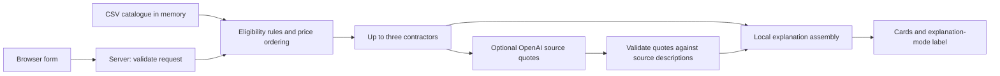

# The Power of Dreams — event contractor selection

A local web application for hackathon task **#79-lite**. It helps an event
organizer in Kazakhstan choose up to three contractors from the supplied
catalogue and understand why they match the event conditions.

The Russian-language form asks for **city, event date, event format, contractor
category and budget in KZT**, with optional language and duration under
**Дополнительные условия**. Results show each contractor's name, category,
city, starting price, explanation and data-provenance labels. The catalogue
contains anonymized and synthetic profiles; this is a demonstration of selection,
not a booking service or a source of confirmed contractor availability.

## Quick start with Docker (recommended for judges)

Install and start [Docker Desktop](https://docs.docker.com/desktop/) with
Linux containers on Windows/macOS, or Docker Engine with the
[Compose plugin](https://docs.docker.com/compose/install/linux/) on Linux.
Use Compose **2.20 or later** (Compose 5 is also supported) and a modern browser.
The first build needs internet access to download the base image, OS build tools
and npm packages; allow several minutes. Node.js and npm run inside Docker.
No database, GPU, provider account or `.env` is required for catalogue-only use.

Clone the repository, or download and extract its ZIP. From its root:

```powershell
git clone https://github.com/BAITC-Hacks/hack-83108e9d-the-power-of-dreams.git
cd hack-83108e9d-the-power-of-dreams
docker compose up --build --wait --wait-timeout 120
```

If you already have the project, run only the last command in its root. Open
[the application](http://localhost:3101) and follow the
[primary scenario](#try-the-primary-scenario) below. The command leaves the
application running in the background and waits for a successful catalogue API
healthcheck. The 120-second readiness limit starts after the build; it does not
limit initial downloads. The image includes the supplied CSV and all runtime
files, uses a non-root user, and exposes the application only on this computer.

Check status and run the supplied HTTP smoke check without installing host Node.js:

```powershell
docker compose ps
docker compose exec -T app node scripts/docker/smoke.mjs
```

Expected: service `app` is `healthy`; the smoke check reports seven passing
selection/validation cases and `Container HTTP smoke passed`. On a fresh checkout,
the modes are `catalog_fallback, not_needed`. This uses the real catalogue and
HTTP API; it does not evaluate live AI explanation quality. **If you configure
OpenAI, the smoke check can make four billable provider requests.**

To inspect startup problems or stop and remove this project's containers/network:

```powershell
docker compose logs --tail 100 app
docker compose down
```

If port 3101 is occupied, set `APP_PORT=3111` in a root `.env` (create it if absent,
or edit that one setting without replacing existing values), run the launch
command again and open [the alternate address](http://localhost:3111).
Restart after configuration changes with
`docker compose up --wait --wait-timeout 120`; rebuild with `--build` after source
changes. `docker compose down` preserves repository files and your local `.env`.

### Optional AI explanations in Docker

Create a root `.env` by copying `.env.example` with your file manager, then fill
only `OPENAI_API_KEY`; `OPENAI_MODEL` is optional. Preserve an existing `.env`.
Run `docker compose up --wait --wait-timeout 120` to recreate the service with the
new settings. No image rebuild is needed. A funded OpenAI project, model access
and outbound internet are required; each non-empty selection can make one
billable request. Missing/failed/rejected AI evidence retains the existing
labelled catalogue or mixed explanations.

Compose reads `.env` for substitution and forwards only `OPENAI_API_KEY` and
`OPENAI_MODEL` to the app. Existing shell variables take precedence, including
an explicitly empty value. A configured key enables live calls automatically.
To use catalogue-only mode, remove/blank the key in `.env` and unset any shell
override before recreating the service. In Compose `.env`, use single quotes
around literal values containing `$` or `#`; unlike the direct Node.js loader,
Compose expands variable references in unquoted/double-quoted values.

Credentials are supplied at runtime; `.env` files are excluded from the build
context and image. Keep them private and out of Git. Avoid sharing expanded
`docker compose config` or container environment output, which can contain keys.

| Docker symptom | Action |
| --- | --- |
| Cannot connect to the Docker daemon / missing Docker Desktop pipe | Start Docker Desktop, enable Linux containers and wait for its engine; `docker info` must succeed. |
| Unknown `--wait` option | Update Compose to 2.20 or later. |
| Build cannot download images or packages | Check internet/proxy access to Docker Hub, Debian and npm registries, then repeat the build. |
| Port is already allocated | Set a free `APP_PORT` as described above. |
| Service is unhealthy or readiness times out | Read `docker compose logs --tail 100 app`; after repairing the cause, repeat `docker compose up --build --wait --wait-timeout 120`. |

Container verification and its exact revisions/limitations are recorded in the
[Docker delivery task card](openspec/changes/docker-compose-delivery/tasks.md).

## Alternative quick start with Node.js

### 1. Install the prerequisites

- Install **Node.js 24.4.1 or a newer 24.x release** from the
  [official Node.js download page](https://nodejs.org/en/download). On Windows,
  use the installer for your architecture with npm included, then reopen your
  terminal. The recorded project environment is Node.js **24.4.1** with npm
  **11.4.2**; these are the baseline versions in [package.json](package.json).
- Install [Git](https://git-scm.com/downloads/) if you will clone the repository.
  You can also download and extract the repository ZIP and open its root folder.
- Use a modern browser. Internet access is needed to download dependencies and,
  when enabled, to call OpenAI.

Check that the tools are available:

```powershell
node --version
npm --version
```

No database, Docker, Python, WSL, GPU, NVIDIA account or separate backend service
is required for this Node.js route. OpenAI access is optional for catalogue-only
operation. The Brev instructions at the end are separate operator tooling.

### 2. Get the project and install dependencies

If you already have the repository, open a terminal in its root (the directory
containing `package.json`) and skip the first two commands:

```powershell
git clone https://github.com/BAITC-Hacks/hack-83108e9d-the-power-of-dreams.git
cd hack-83108e9d-the-power-of-dreams
npm ci
```

`npm ci` installs the runtime and development dependencies pinned in
[package-lock.json](package-lock.json). Do not install Next.js, React or
`csv-parse` individually or globally. Keep development dependencies installed
for the build and checks. No separate dataset download is needed:
`raw/dataset.csv` is included in the repository.

### 3. Choose the explanation mode

**Without OpenAI:** skip configuration on a fresh checkout. The app still reads
the supplied CSV, selects contractors and explains matching format and budget.
It labels these explanations as generated from catalogue fields without AI.

**With OpenAI:** before starting the server, create the local configuration:

```powershell
node scripts/secrets/setup.mjs
```

Open the root `.env` locally and fill `OPENAI_API_KEY`. Leave the other service
keys blank; they are not used by this application. `OPENAI_MODEL` is optional;
absent or blank uses `gpt-4.1-mini-2025-04-14`. The setup command preserves an
existing `.env`. Verify that the key is present without displaying it:

```powershell
node scripts/secrets/check.mjs OPENAI_API_KEY
```

This checks configuration presence only. Live use requires a funded OpenAI
project, access to the configured model and outbound network access. Each
submission with selected contractors can make one billable request. Existing
environment variables take precedence over `.env`; an already configured key
enables live calls. See [configuration details](#configuration-details) for
precedence, safe handling and optional settings.

### 4. Build and start

Run from the repository root:

```powershell
npm run build
npm start -- --port 3000
```

Keep the terminal running and open [the application](http://127.0.0.1:3000).
Stop the server with `Ctrl+C`. Both start scripts bind to `127.0.0.1` for local
access. Retain `raw/` and `back/` alongside the application: the server loads
the CSV and the existing OpenAI transport from these directories at runtime.
Copying only the build output is insufficient.

### Development mode

After installation and any optional configuration, use this instead of the
build/start pair while editing the app:

```powershell
npm run dev
```

Open [the development server](http://127.0.0.1:3000). To choose a free port,
use `npm run dev -- --port 3102`; for a production build use
`npm start -- --port 3102`. These commands follow the
[Next.js CLI options](https://github.com/vercel/next.js/blob/canary/docs/01-app/03-api-reference/06-cli/next.mdx).

## Try the primary scenario

Enter the following values and press **Подобрать**:

| Field | Value |
| --- | --- |
| City | Алматы |
| Date | 2026-10-10 |
| Event format | корпоратив |
| Category | Ведущий |
| Budget | 1500000 KZT |

Expected with the supplied catalogue: **10 candidates, 5 eligible**, with these
three cards in order: **Куррапика (HK-88430)**, **Аня Форджер (HK-29829)**,
**Сон Гоку (HK-27222)**. Selection and order are the same with or without OpenAI;
the explanations depend on whether validated source quotes are available.

Change the budget to **1** and submit again: the app should display a normal
empty result. Changing fields alone does not make an AI request. To check a
different date, change the date and press **Подобрать** again.

For a short demonstration, continue with these inputs (leave optional fields blank):

| Case | Change from the primary scenario | Expected result |
| --- | --- | --- |
| Rare category | Category Флорист, format свадьба, budget 500000 | One card: HK-39372; explanation of the incomplete three-card set |
| No category in city | Rare inputs, city Зарубежье | Explicit category-absent outcome |
| Busy-date change | Primary inputs, date 2026-10-11 | HK-44923, HK-27222, HK-44733; date comparison explains busy marks |
| Price-order date change | Primary inputs, submit October 1 then October 6 | HK-75012 is replaced by HK-29829 through starting-price order, not a new busy mark |

Reset restores the primary defaults. Explain that filtering and price/ID order
select the cards; optional AI supplies source quotes only. Starting prices and
calendar marks never guarantee booking. Dataset and software provenance is in
[THIRD_PARTY.md](THIRD_PARTY.md).

Previous results keep their original conditions while you edit or wait for a
new selection, and survive a failed request. Date-only submissions explain
changes using catalogue busy marks and price/ID order. For example, changing
October 1 to October 6 replaces HK-75012 with HK-29829 because of starting-price
order; HK-75012 still has no busy mark. **Сбросить** restores supported initial
defaults, clears results and optional conditions, and cancels pending work.
Blank optional values do not filter results; supplied duration accepts positive
fractional hours. All categories remain selectable in every city, including
combinations that correctly produce an empty catalogue outcome.

## How it works

The app is one Next.js process serving both the browser interface and HTTP API.
The catalogue is loaded into memory on first use and retained for the process.



1. The form loads available options from `GET /api/catalog/options` and sends
   conditions to `POST /api/recommendations` only on submission.
2. The server validates the fields and supported date range. Selection first
   narrows the catalogue by city and category, then excludes busy contractors,
   prices above the budget and unsupported event formats. The backend also
   supports the form's optional language and duration filters.
3. Eligible profiles are sorted by ascending starting price, then catalogue ID
   to break ties. The first three become the result. **AI does not rank profiles
   or decide which contractors pass the filters.**
4. If configured, one bounded OpenAI request receives the conditions and evidence
   fields for only the selected profiles. It selects short quotes from their
   descriptions. Local code checks the response structure, profile IDs, quote
   length and literal correspondence with the source before using a quote.
5. Local code assembles explanations from catalogue facts and accepted quotes.
   Missing configuration, provider failure or rejected quotes lead to
   catalogue-only or mixed explanations with a visible label. The underlying
   selection continues to use the supplied CSV. This is not a synthetic test
   fixture substituted for the catalogue.

## Stack and repository layout

All package versions are pinned in [package.json](package.json) and the lockfile.

| Dependency / tool | Role |
| --- | --- |
| Next.js 16.3.6 | Web application and server routes in one process |
| React / React DOM 19.3.0 | Browser form and result cards |
| TypeScript 6.0.3 | Typed contracts and application code |
| csv-parse 7.0.2 | Decode the supplied CSV catalogue |
| Tailwind CSS 4.3.3 / PostCSS 8.5.28 | Installed styling toolchain |
| Zod 4.6.5 | Available validation dependency; current request rules are implemented in server code |
| Node.js test runner | Runs the checks wired to `npm test` |
| Playwright 1.63.0 | Browser verification tooling |
| ESLint 9.39.5 / Vitest 5.0.1 | Installed development tooling; no lint script is currently defined, and `npm test` uses Node's runner |

OpenAI is called through the existing server HTTP adapter; no OpenAI SDK or
additional package installation is required. ESLint remains pinned to major 9
for compatibility with the current Next.js lint configuration.

| Path | Responsibility |
| --- | --- |
| `src/app/` | Page entry point, layout, styles and API routes |
| `front/` | Interactive form, loading/error/empty states and result cards |
| `contracts/` | Public request/response types and labelled examples |
| `back/catalog/`, `back/domain/` | CSV loading, calendar and deterministic selection rules |
| `back/recommend/`, `back/ai/` | Explanation assembly, quote validation and OpenAI transport |
| `back/http/`, `back/composition.ts` | Request validation, HTTP responses and module wiring |
| `back/config/` | Server-only secrets reader |
| `raw/dataset.csv` | Supplied runtime catalogue |
| `scripts/` | Verification and optional operator utilities |
| `domain/`, `architecture/`, `openspec/` | Source requirements, architecture and implementation evidence |

## Checks and troubleshooting

After `npm ci`, run these from the root:

```powershell
npm ls --depth=0
npm run typecheck
npm test
```

Expected: required dependency versions are installed, type checking succeeds,
and secrets, transport, contract, slice, catalogue, selection, evidence,
backend-configuration and frontend-comparison checks pass. These tests use controlled credentials and
transport where needed; no `.env`, provider account, billable call or Playwright
browser installation is required. They do not replace the browser scenario or
live explanation-quality review. `npx playwright install` is optional for
browser-test tooling, not an application prerequisite.

| Symptom | Action |
| --- | --- |
| `node` or `npm` is not recognized | Install Node.js with npm, reopen the terminal and check the versions. |
| Missing `csv-parse`, `UNMET DEPENDENCY`, or stale/extra packages | Stop this checkout's server and run `npm ci` in the root, then repeat the dependency check. Keep the committed lockfile. |
| Start reports a missing production build | Run `npm run build` successfully before `npm start`. |
| Port is already in use | Choose another port with `-- --port 3102` and open the corresponding URL. |
| Date is rejected | Use a date between **2026-09-23 and 2026-12-31**, inclusive. |
| Catalogue is unavailable | Ensure `raw/dataset.csv` exists and is intact, run from the root, then restart the server after repair. Failed catalogue loads are retained until restart. |
| Explanations say they were generated without AI | This is a supported result. For live quotes, check the OpenAI setting, account/model access and network. Rejected quotes also fall back to catalogue facts. Restart after configuration changes. |

Optional live domain check, after configuring OpenAI:

```powershell
node scripts/slice/live.mjs
```

This makes one billable dense-domain request and prints public output and
sanitized evidence metadata. Full live acceptance also needs manual review of
source correctness, relevance and distinctiveness. A fallback is not a live
quality pass.

## Limitations and verification status

- The supplied calendar covers **23 September–31 December 2026** only.
- Prices are starting prices. A date without a busy mark is not a confirmed
  booking; availability and final conditions must be checked with the contractor.
- Synthetic/anonymized profiles and imputed city/price values are labelled.
- There are no booking, messaging or saved-search features, no persistent user
  data, and no AI quality ranking.
- Date comparisons apply only when the date changes and all other normalized
  conditions, catalogue version and selection policy are unchanged. Only the
  latest successful result is kept in memory; reset or reload clears it.
- Catalogue/configuration changes require a server restart.

Recorded acceptance belongs to the linked revisions and scopes, not to every
future checkout. Final live rendered-text decisions, three-request timings,
clean-checkout evidence and exact publication status are in the
[P07 delivery task card](openspec/changes/integration-and-delivery/tasks.md).
Repository publication is separate from submission to the organizer; no
organizer submission is performed by the run instructions.

To reproduce the final live timing series after the production build, stop any
server on port 3107 and run `node scripts/delivery/live.mjs` with local OpenAI
configuration. It starts and stops its own production server and makes exactly
three application submissions (dense, rare, dense); normal provider retry policy
still applies. It requires the Playwright tooling already pinned in the lockfile
and Microsoft Edge installed locally. Results and public screenshots are written
under ignored `test-results/p07-live`. It fails on live fallback; per-card semantic
quality still needs review against the source. This optional acceptance tooling
is not required to use the application and incurs paid API usage.

| Area | Requirements and recorded evidence |
| --- | --- |
| Foundation and public contracts | [P00 task card](openspec/changes/archive/2026-09-23-foundation-and-contracts/tasks.md) |
| First working browser scenario and clean build/start | [P01 task card](openspec/changes/archive/2026-09-23-first-working-slice/tasks.md) |
| Catalogue loading | [P02 task card](openspec/changes/archive/2026-09-23-catalog-module/tasks.md) |
| Selection rules | [P03 task card](openspec/changes/archive/2026-09-23-selection-domain/tasks.md) |
| Validated AI evidence | [P04 task card](openspec/changes/archive/2026-09-23-validated-ai-evidence/tasks.md) |
| Connected backend and frontend handoff | [P05 task card](openspec/changes/archive/2026-09-23-backend-composition-and-handoff/tasks.md) |
| Complete frontend flow and date comparison | [P06 task card](openspec/changes/archive/2026-09-23-frontend-selection-flow/tasks.md) |

For product context, start with [domain documentation](domain/README.md).
See [architecture](architecture/README.md) for design and
[OpenSpec](openspec/) for requirements and current task evidence. The
[module proposal sequence](.proposals/README.md) preserves the original planning
order; it is not an instruction to reimplement completed modules.

## Configuration details

Requires Node.js 24.4.1 or compatible Node.js 24. These commands need no
additional packages. Run from the repository root:

```powershell
node scripts/secrets/setup.mjs
```

This creates one root `.env` from [.env.example](.env.example). An existing
`.env` is left unchanged. Open the file locally and fill the settings you use:

| Setting | Purpose | Required when |
| --- | --- | --- |
| `OPENAI_API_KEY` | OpenAI API credential | A server operation uses OpenAI |
| `OPENAI_MODEL` | Optional model override; blank uses `gpt-4.1-mini-2025-04-14` | Only to override the default OpenAI model |
| `NVIDIA_API_KEY` | Reserved NVIDIA API credential | Not used by the current application |
| `BREV_API_KEY` | Brev organization credential | Only for the optional Brev operator scripts |
| `DATABASE_URL` | Reserved database connection URI | Not used by the current application |

The selected contractor-selection MVP does not use a database. The reserved
`DATABASE_URL` setting is only for a future explicitly scoped integration.
Quote values containing `#` or
whitespace. Values are literal; references such as `${OTHER_VARIABLE}` are
not expanded. Add future secrets to the same file and document their empty
entries in the template.

For this application, check only the OpenAI key if using live quotes:

```powershell
node scripts/secrets/check.mjs OPENAI_API_KEY
```

A successful check exits with
code 0 and says required settings are present. Missing or blank values exit
with code 1 and name the missing settings without printing their values.
Running without names shows usage and fails. This checks presence only;
it does not validate credentials, contact providers, or connect to a database.

Existing process environment variables take precedence over the file, including
blank values (which fail validation). This also supports deployments supplying
all settings through their environment without a file. The scripts locate the
root file relative to their own location, independently of the working directory.

Keep the filled `.env` out of Git, public archives, screenshots, logs, and
browser code. Git ignores `.env` and its variants but cannot prevent a forced
add. The file is plaintext: restrict local access. Organizers can use their own
credentials. If team credentials are provided, transfer the file separately
through an agreed private channel; never put them in a repository or public link.
Only the empty template belongs in the repository.

### Server integration reference for developers

The server composition calls
the reader before external operations and passes only the required values to
the corresponding adapters:

```javascript
import { loadSecrets } from './back/config/secrets.mjs';

const { OPENAI_API_KEY } = loadSecrets({ required: ['OPENAI_API_KEY'] });
// Pass the value to the server adapter; never log or return it to a client.
```

The import above is relative to a server entry point in the repository root.
The reader returns a frozen object containing only the requested names; it
does not mutate `process.env`. Errors have a stable `code`, a safe `message`,
and a `requestId`. Browser modules must not import `back/config/`; names
starting with `NEXT_PUBLIC_` are rejected. The P01 task card records application integration separately from the original secrets checks.

Run the focused checks with synthetic temporary credentials:

```powershell
node --test scripts/secrets/secrets.test.mjs
```

Current requirements and verification status:
[OpenSpec tasks](openspec/changes/unified-local-secrets/tasks.md).

## OpenAI server adapter reference for developers

Requires Node.js 24 and a funded OpenAI API project with model access. No SDK,
GPU or additional npm installation is required for this module. Run the secrets
setup above and fill `OPENAI_API_KEY` privately. `OPENAI_MODEL` is optional;
absent or blank selects `gpt-4.1-mini-2025-04-14`.

```powershell
node scripts/openai/check.mjs
node --test scripts/openai/contract.test.mjs
```

The first command makes one billable live request with a fixed benign prompt.
Expected: JSON with `ok: true`, `mode: live`, the model, token usage and duration.
It prints neither the key nor provider response contents. The second command
uses synthetic credentials and a local test server; it incurs no provider cost.

From a server module at the repository root:

```javascript
import { createOpenAIFromEnv } from './back/ai/openai.mjs';

const openai = createOpenAIFromEnv();
const result = await openai.generate({
  input: 'Summarize the supplied text.',
  instructions: 'Use only facts from the input.',
  maxOutputTokens: 450,
  // signal: callerAbortSignal,
});
// Use result.text; do not log private inputs or secrets.
```

`generate` also accepts developer-controlled `format: { name, schema }` for
strict JSON-schema output. The caller must parse and validate domain data.
Results include `text`, `provider`, `mode`, `model`, `responseId`, `requestId`
and optional `usage` with input/output/total token counts. Errors have a safe
`message`, stable `code` and `requestId`. Codes distinguish configuration/input,
authorization, rate/quota limits, rejected requests, provider unavailability,
invalid/incomplete/refused responses, network failures, timeout and cancellation.
The live check exits nonzero and prints the code on failure.

Calls use Responses with `store: false`, a six-second deadline including body
consumption, caller cancellation, zero retries and no fallback. Local cancellation
does not guarantee cancellation of provider billing. Never import this Node-only
module into browser components. This verifies transport access; application
routes, contractor selection and UI integration are recorded separately in the P01 task card.
See [adapter requirements and evidence](openspec/changes/openai-response-adapter/tasks.md).

## Optional operator tooling: Brev GPU access

This section is not part of application installation or launch. WSL, Brev and
the GPU packages below are needed only when operating this separate environment.

The existing `dreams-gpu` environment is infrastructure for a future specialized
GPU workload. These commands verify access and CUDA computation; they do not
provide a product inference API or an OpenAI adapter.

On Windows, install Ubuntu if absent:

```powershell
wsl --install -d Ubuntu-22.04 --no-launch
```

Install the official Brev CLI in that distribution (observed version v0.6.335):

```powershell
wsl -d Ubuntu-22.04 -u root -- bash -lc 'curl -fsSL https://raw.githubusercontent.com/brevdev/brev-cli/main/bin/install-latest.sh -o /tmp/brev-install.sh && BREV_INSTALL_DIR=/usr/local/bin bash /tmp/brev-install.sh'
```

Create the local `.env` with the secrets setup command above and privately add
`BREV_API_KEY`. This is a Brev organization key, distinct from NVIDIA hosted-model
and NGC credentials. The operator wrapper passes it via process environment;
it does not require putting the key in command history. In this Windows setup,
Brev configuration belongs to root inside Ubuntu-22.04. On Linux, install Brev
for the current user; the wrapper invokes it directly (Linux route not verified).

From the repository root:

```powershell
node scripts/brev/run.mjs status
node scripts/brev/run.mjs refresh
node scripts/brev/run.mjs gpu
node scripts/brev/run.mjs setup
node scripts/brev/run.mjs smoke
```

Expected: the environment is `RUNNING`/`HEALTHY`, the GPU command reports L40S,
and smoke returns JSON with `status: passed`, `mode: live`, and `result_value: 256`.
Setup explicitly installs PyTorch 2.13.0 with CUDA 12.6 and NumPy 2.2.6 in
`/data/dreams-gpu/.venv`; it records resolved packages in
`/data/dreams-gpu/installed-requirements.txt`. It requires an Ubuntu GPU VM,
noninteractive sudo and an existing `/data` disk. The VM was configured in the
recorded verification; its current availability must be checked before use.
Both SSH and outbound access to official package sources must be available.

Use another existing environment with `--instance NAME` before the operation.
Trusted operator commands can be run with
`node scripts/brev/run.mjs exec "python3 --version"`.
The wrapper exits nonzero on failures and times out after 120 seconds (setup:
600 seconds); timeout does not guarantee cancellation on the remote machine.
Never expose this operator command through the application or run commands that
print credentials. First-time SSH access can require `brev login` if the account
does not support the API-key/certificate flow verified here.

The selected portal rate was $1.77/hour: $1.74 compute plus $0.03 storage.
Use Stop in the Brev portal after use; storage continues billing while stopped.
No instance is created, stopped, deleted, or publicly exposed by these scripts.
See [verification and outstanding product work](openspec/changes/brev-gpu-access/tasks.md).
