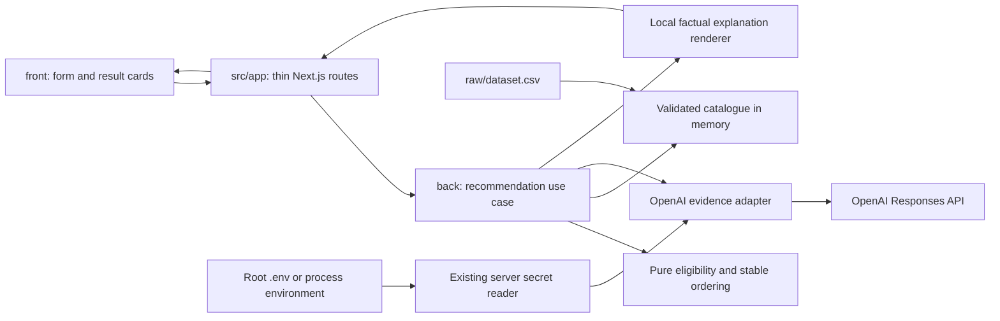

# System architecture

Status: OpenAI-first MVP direction agreed on 2026-09-23; implementation contracts and execution remain pending. Scope and approval record: [index](README.md).

## Decision and alternatives

Use the existing Node.js / Next.js / React / TypeScript stack as one local application. The catalogue has 66 profiles, fits in memory, and has no write, booking or account workflow. A database and separate backend deployment would add setup without satisfying another acceptance criterion.

| Approach | Benefit | Cost within four hours | Decision |
| --- | --- | --- | --- |
| Local rules + one OpenAI evidence-selection call | Simple eligibility, stable order, request-specific evidence from descriptions | Requires one live integration and honest fallback | Selected MVP direction |
| Precompute evidence with AI; serve templates | No runtime AI dependency | A preparation pipeline, verification of 66 profiles and invalidation when CSV changes | Defer |
| Embeddings or LLM ranking after filters | Could support future free-text preferences | Adds scoring decisions and relevance evaluation; LLM ordering is unsuitable for repeatability | Defer; no current free-text requirement |

This is an engineering judgement, not a measured performance comparison. The selected baseline optimizes time to the required demo; it does not claim that price ordering measures contractor quality.

## Components and flow

The browser uses same-origin JSON operations. It never imports `back/`, reads CSV, or receives credentials. Rules use plain data, with no dependency on Next.js, filesystem access, OpenAI, or a storage library. The composition root connects the catalogue and AI adapter to the use case; a few functions are sufficient, without a dependency-injection framework or generic repository abstraction.

## Proposed code boundaries

These are future paths, not existing application files. One coordinator can implement the first complete scenario sequentially. Ownership below is a responsibility split, not a claim that workers have been assigned.

| Boundary / owner | Operations and data | Allowed dependencies | Verification |
| --- | --- | --- | --- |
| `contracts/`, coordinator | Public request/result/error types; string IDs and date-only ISO values; no secrets or catalogue internals | Plain TypeScript only | Contract examples consumed by both HTTP and UI |
| `back/catalog/`, backend owner | `loadCatalog(path)` returns immutable profiles and form options; owns CSV decoding, validation and snapshot | Filesystem, `csv-parse`, Zod, plain domain types | Supplied snapshot, quoted commas, pipe lists, flags, null hours, invalid records |
| `back/domain/`, backend owner (excluding coordinator-owned `date.ts` and shared types) | `select(profiles, request)` returns ordered eligible IDs and exclusions; owns eligibility and ranking rules | Plain domain/public types only | Dataset scenarios, stable tie, boundaries and busy venue |
| `back/recommend/`, backend owner | `recommend(request, signal)` obtains selection, requests evidence and renders public cards; owns orchestration | Domain functions and injected catalogue/explanation functions | Real catalogue through HTTP, controlled upstream failure |
| `back/ai/`, backend owner | `selectEvidence(request, profiles, signal)` returns a complete ID mapping of accepted quote/per-card fallback, or a typed whole-batch unavailable result; owns provider schema and validation | Native server `fetch`, Zod, plain port types | Whole-batch structural/ID failures versus per-card quote failures, including source mismatch |
| `back/http/`, coordinator | Decode/validate input, invoke use case, format JSON/errors | Public types, Zod, composition root | Status codes, safe errors, no business rules in handlers |
| `back/composition.ts`, coordinator | Resolve root paths, load catalogue/secrets once, inject adapters; catch expected AI configuration errors only within AI setup | Server modules; existing `back/config/secrets.mjs` | Built launch with explicit paths; missing key/unreadable environment disables AI, not catalogue; unrelated faults propagate |
| `src/app/`, coordinator | Thin Next.js layout/page and route entry points; Node.js runtime for server operations | `front/` for page composition; `back/http/` only from server routes | Build and local production launch |
| `front/`, frontend owner | Form, loading/validation, cards, empty states, previous successful request/cards/busy-ID snapshot for date comparison | React, public contracts, same-origin HTTP | Both directions of calendar replacement, mixed-explanation label, keyboard focus, mobile/desktop readability |

Application frontend stays in `front/`, backend in `back/`; `src/app/` is the framework shell. `contracts/` is source code shared by consumers, distinct from the immutable handoff packages under `.shared/specs/` required if frontend work is delegated later.

## Public operation outline

This is a design outline, not a published API package. Freeze exact DTOs and success/error examples in the product OpenSpec change before implementation by separate consumers.

| Operation | Proposed boundary |
| --- | --- |
| `GET /api/catalog/options` | Global city/category/format/language options and the supported date window; keep globally valid categories selectable even when absent from a particular city |
| `POST /api/recommendations` | Required `city`, `date`, `eventFormat`, `category`, `budgetKzt`; optional `durationHours`, `language`; omitted optional values are absent, not `null` |
| Successful result | `requestId`, `outcome`, `cards`, `summary`, `explanationMode`; outcomes `matched`, `category_absent`, `no_match` all use HTTP 200; explanation modes are `openai_evidence`, `mixed`, `catalog_fallback`, `not_needed` as defined in [selection](selection-and-explanations.md#explanation-mode-and-visible-label) |
| Card | `id`, `name`, selected `category`, `city`, `priceFromKzt`, `explanation`, catalogue quality flags; retain the `price_from` meaning |
| Summary | Candidate/eligible counts, exclusive first-failure counts and `busyProfileIds` for every busy profile in this city/category (including those not displayed); retain both old/new sets to explain becoming busy, becoming available and price/ID displacement |
| Invalid input | HTTP 400; `{error: {code, message, requestId}}`; optional field-level details; `INVALID_REQUEST` or `DATE_OUT_OF_RANGE` |
| Catalogue unavailable | HTTP 503 with `CATALOG_UNAVAILABLE`; never replace a corrupt/missing catalogue with invented profiles |
| Unexpected failure | HTTP 500 with `INTERNAL_ERROR` and a safe message; never return provider payloads or stack traces |

Busy IDs are diagnostic data, not recommendation cards. No endpoint exposes all descriptions, full calendars or the secret reader. No authentication, booking, history storage, streaming, pagination or administrative API is needed for the local demo.

## Runtime, resources and setup

- Keep the currently pinned stack in [package.json](../package.json): Next.js 16.3.6, React 19.3.0, TypeScript 6.0.3, Zod 4.6.5 and existing test tools. These are observed package declarations, not evidence of an application build.
- Add and pin only a CSV parser (`csv-parse`) for correct quoted-field parsing. Use the existing validation tools and native server HTTP for the small OpenAI adapter. An AI orchestration SDK, Python environment and database driver are unnecessary for this design.
- Run from the repository root, using one Node.js process and port 3000 bound to `127.0.0.1`. Proposed future scripts map to Next.js development, build and production start. They do not exist in the current `package.json`; actual commands belong in README when implemented.
- Resolve absolute paths to root `raw/dataset.csv` and `.env` in composition; pass the root environment path explicitly to the existing loader. Do not assume source-relative paths survive bundling. Load CSV once per process and restart after source changes; no hot reload/import pipeline is needed.
- Reuse `loadSecrets({required: ['OPENAI_API_KEY'], ...})` for the baseline inside the narrow AI-configuration error boundary below. Only server composition passes the returned value to the AI adapter; it does not rely on mutation of `process.env`. The application requests only OpenAI settings; catalogue data comes from the supplied CSV.
- Organizer prerequisites: Node.js 24 compatible with the declared engine, npm, dependencies installed from the lockfile, repository data, and a funded OpenAI API project/key with model access. Package installation and live AI need network access. No GPU, Docker, Redis, hosted database or deployment account is required.
- Missing key or an environment file reported unreadable by the loader allows explicit catalogue explanations under the policy below, but cannot pass the live-AI acceptance check. A rejected nonblank API key is a provider error handled by the same local explanation fallback. Missing/corrupt CSV prevents meaningful selection and produces the catalogue error.
- Keep server configuration/AI/file modules behind server-only imports. Log only request ID, operation, duration, mode, error category and available token usage; no key, prompt, profile text or raw provider response.

Hosting is outside this four-hour local-demo architecture. If a public URL becomes a requirement, revise deployment, key-spend protection and startup assumptions before exposing the service.

### AI configuration failure boundary

Keep the existing secret loader's contract unchanged. In composition, wrap only the AI secret-loading operation, not catalogue loading or the entire application bootstrap. Handle the exported `ConfigurationError` by its known code:

| Loader outcome | Composition behaviour |
| --- | --- |
| Valid requested value | Construct the OpenAI adapter; pass the value privately, without logging it |
| `CONFIG_REQUIRED` | Missing/blank key: inject an unavailable AI adapter; keep catalogue options and recommendations operational |
| `CONFIG_FILE_UNREADABLE` | Inject the same unavailable adapter and record the safe configuration error category; do not crash the catalogue path or bypass the loader by trying alternative files |
| `CONFIG_INVALID_REQUEST` or unexpected exception | Propagate as an application/configuration fault; do not disguise a wiring/programming error as ordinary AI unavailability |

The unavailable adapter immediately returns a typed unavailable result without network work, retries or a second provider call. Nonempty results then use local explanations with `catalog_fallback`; empty outcomes use `not_needed`. Log the safe error code/category and request/diagnostic ID, not the environment file's content, raw exception or key. The UI shows the normal non-AI explanation label without filesystem details.

The current loader reads the requested environment file before applying process-environment precedence. Consequently, an unreadable `.env` disables AI under this policy even if a process variable is populated; do not claim an environment-only recovery that the loader does not implement. A missing file (`ENOENT`) is permitted by the loader, so a valid process variable still works without a file. Repair configuration and restart to rebuild the adapter; catalogue operation remains independent throughout.

## Documentation evidence

Consulted on 2026-09-23. Context7 resolved official Next.js and Node CSV repositories; indexed Next.js examples were not an exact 16.3.6 version reference. The build against the repository's pinned version remains required.

- [Next.js route handlers](https://nextjs.org/docs/app/api-reference/file-conventions/route): a route boundary within the same application.
- [Server and client components](https://nextjs.org/docs/app/getting-started/server-and-client-components): server-only boundaries and client composition.
- [Next.js CLI](https://nextjs.org/docs/app/api-reference/cli/next): production build/start and explicit hostname.
- [Node CSV synchronous parser](https://csv.js.org/parse/api/sync/): appropriate API for a small, fully loaded CSV file.

## Shared calendar boundary

P02 publishes the existing pure isCalendarDate operation in back/domain/date.ts as coordinator-owned shared backend code, pinned at f9ed31fb5b4c99d42c1051d3cd43cc9f5af59766. Catalogue and request validation may consume it; P02/P03 owners may not independently edit it. See [catalogue design](../openspec/changes/archive/2026-09-23-catalog-module/design.md) for its contract and verification.
